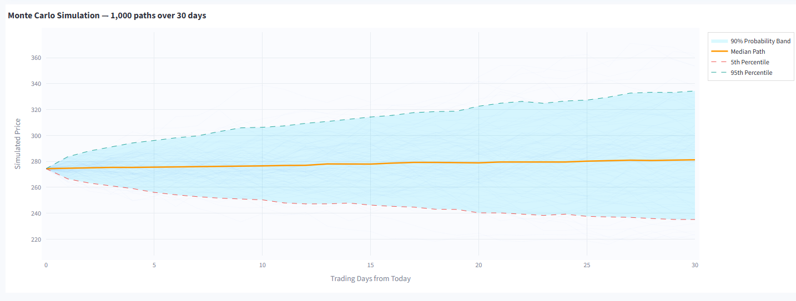

# 📈 Stock Analysis Dashboard

[](https://python.org)
[](https://streamlit.io)
[](LICENSE)

A **Streamlit-based stock analysis dashboard** combining probability & statistics with machine learning to analyze stock market data. Features interactive visualizations, ML predictions, Monte Carlo simulations, and anomaly detection.




---

## ✨ Features

| Feature                      | Description                                                                           |
| ---------------------------- | ------------------------------------------------------------------------------------- |
| 📈 **Live Charts**           | Real-time stock data from Yahoo Finance with candlesticks, RSI, and probability bands |
| 🤖 **ML Prediction**         | Linear Regression model predicting next-day closing prices (R² > 0.95)                |
| 🎲 **Monte Carlo**           | Up to 10,000 simulations for probabilistic price forecasting                          |
| 🔍 **Anomaly Detection**     | Isolation Forest algorithm to identify unusual trading days                           |
| 📊 **Statistics**            | Comprehensive statistical analysis (mean, std, skewness, kurtosis, VaR)               |
| 📋 **Summary Report**        | Executive-style report with health scores and investment signals                      |
| 🔄 **Dual-Stock Comparison** | Compare two stocks side-by-side                                                       |

---

## 🚀 Quick Start

### Prerequisites

- Python 3.8+
- pip package manager

### Installation

```bash
# Clone the repository
git clone https://github.com/yourusername/stock-analysis-dashboard.git
cd stock-analysis-dashboard

# Install dependencies
pip install streamlit pandas numpy plotly scikit-learn scipy yfinance

# Verify installation
python -c "import streamlit, pandas, numpy, plotly, sklearn, scipy, yfinance; print('Ready!')"
```

### Running the App

```bash
# Main dashboard (7 analysis tabs)
streamlit run main.py

# CSV Generator (download stock data)
streamlit run generate_csv.py
```

Opens at `http://localhost:8501`

---

## 📂 Project Structure

```
├── main.py              # Main dashboard entrypoint
├── tabs/                # Modular tab components
│   ├── live.py          # Live Chart tab
│   ├── csv_analysis.py  # CSV Analysis tab
│   ├── ml_prediction.py # ML Prediction tab
│   ├── statistics.py    # Statistics tab
│   ├── monte_carlo.py   # Monte Carlo tab
│   ├── anomaly_detection.py # Anomaly Detection tab
│   └── summary.py       # Summary tab
├── generate_csv.py      # Standalone CSV downloader
├── code.py              # Legacy monolithic version
├── DOCUMENTATION.md     # Detailed documentation
├── research_paper.tex   # LaTeX research paper
└── figures/             # Generated charts and screenshots
```

---

## 🎯 Usage Workflow

1. **Generate Data**: Run `generate_csv.py` → Select stock/crypto → Download CSV
2. **Upload Data**: Run `main.py` → Go to "CSV Analysis" tab → Upload CSV
3. **Analyze**: Explore ML Prediction, Statistics, Monte Carlo, and Anomaly tabs
4. **Compare**: Upload a second CSV for dual-stock comparison

---

## 📊 Dashboard Tabs

### Tab 1: 📈 Live Chart

- Real-time candlestick/line charts
- 68% probability bands (μ ± σ)
- RSI(14) momentum indicator
- Volume with color coding

### Tab 2: 📂 CSV Analysis

- Upload historical OHLCV data
- Automatic feature engineering
- Trend, volatility, and momentum analysis
- Support/resistance levels

### Tab 3: 🤖 ML Prediction

- Linear Regression model
- Configurable train-test split (10-40%)
- Feature importance visualization
- Tomorrow's price prediction

### Tab 4: 📊 Statistics

- Descriptive statistics table
- Return distribution histogram
- Box plot for outliers
- Cumulative return chart

### Tab 5: 🎲 Monte Carlo

- 100-10,000 simulations
- 5-252 day forecast horizon
- 68%/90%/95% confidence bands
- Probability of profit metric

### Tab 6: 🔍 Anomaly Detection

- Isolation Forest algorithm
- Configurable contamination rate
- Anomaly score timeline
- Flagged unusual trading days

### Tab 7: 📋 Summary

- Executive report with all metrics
- Health score (0-100)
- Combined ML + Monte Carlo signal
- Dual-stock investment pick

---

## 🧮 P&S Concepts Applied

| Concept             | Application                                    |
| ------------------- | ---------------------------------------------- |
| Normal Distribution | 68% probability bands, Monte Carlo sampling    |
| Linear Regression   | Next-day price prediction, trend analysis      |
| Monte Carlo Method  | Probabilistic forecasting with random sampling |
| Isolation Forest    | Unsupervised anomaly detection                 |
| Value-at-Risk (VaR) | 5th percentile risk measure                    |
| RSI                 | Momentum oscillator (14-period)                |
| Standard Deviation  | Volatility measurement                         |
| Skewness & Kurtosis | Distribution shape analysis                    |

---

## 📋 CSV Format

Your CSV file should contain:

| Column   | Required | Description       |
| -------- | -------- | ----------------- |
| `Date`   | ✅       | YYYY-MM-DD format |
| `Open`   | ✅       | Opening price     |
| `High`   | ✅       | Highest price     |
| `Low`    | ✅       | Lowest price      |
| `Close`  | ✅       | Closing price     |
| `Volume` | Optional | Trading volume    |

---

## 🛠️ Tech Stack

| Technology       | Purpose               |
| ---------------- | --------------------- |
| **Python 3**     | Core language         |
| **Streamlit**    | Web framework         |
| **Pandas/NumPy** | Data processing       |
| **Plotly**       | Interactive charts    |
| **Scikit-Learn** | ML models             |
| **SciPy**        | Statistical functions |
| **yfinance**     | Market data API       |

---

## 📈 Sample Results (GOOGL 5-Year Analysis)

| Metric                   | Value    |
| ------------------------ | -------- |
| Total Return             | +170.42% |
| Daily Volatility         | 1.94%    |
| Win Rate                 | 53.23%   |
| ML R² Score              | 0.995    |
| VaR (5%)                 | -2.89%   |
| Monte Carlo Profit Prob. | 59.3%    |

---

## ⚠️ Troubleshooting

| Issue                    | Solution                                     |
| ------------------------ | -------------------------------------------- |
| "yfinance not installed" | `pip install yfinance`                       |
| Empty CSV Analysis       | Ensure columns: Date, Open, High, Low, Close |
| Slow Monte Carlo         | Reduce simulations to 1,000-5,000            |
| RSI shows NaN            | Need ≥14 data rows                           |

---

## 📄 Documentation

- **[DOCUMENTATION.md](DOCUMENTATION.md)** - Comprehensive project documentation
- **[research_paper.tex](research_paper.tex)** - Academic LaTeX paper

---

## 🤝 Contributing

1. Fork the repository
2. Create a feature branch (`git checkout -b feature/amazing`)
3. Commit changes (`git commit -m 'Add amazing feature'`)
4. Push to branch (`git push origin feature/amazing`)
5. Open a Pull Request

---

## 📜 License

This project is licensed under the MIT License - see the [LICENSE](LICENSE) file for details.

---

## 🙏 Acknowledgments

- **Yahoo Finance** - Market data via yfinance API
- **Streamlit** - Rapid prototyping framework

---

